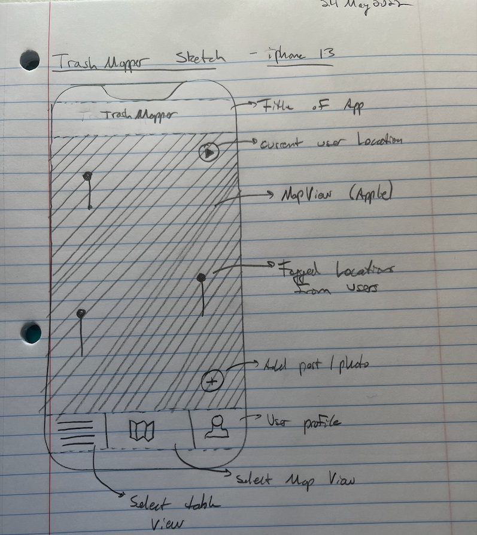

In this post I will go over the layout of the app.

I decided to hand sketch since it's the easiest way to peel ideas from my head. I eventually want to use [Figma](https://www.figma.com/files/recent?fuid=1063954858343816564) to model the app before diving into code. There is some learning and patience involved with sketching through Figma which is while I'm avoiding it for the time being. I'd prefer to focus more on the code, implementation, and playing around with ideas.

---

## Sketch

Here is my hand sketch of the app with some feature callouts. More details provided below.

---

## Feature Callouts

The few features are called out on the side, but will provide more details here.

The main view is to be Apple MapKit view. Location markers on the map will be displayed if available and contain photo/post information. Alongside markers, two buttons on the right will be shown, and a tableBar at the bottom will be provided.

The two functional buttons on the right side of the MapView will be

- (Go-to) Current User Location (zoom in w/ necessary span)
- Add button to add photo/post of trash where the user currently is
  - Side note that the user will not need to move the marker as the add button will automatically collect the user long/lat

The bottom tableBar will contain the following buttons:

- User profile
  - Update, delete user profile, etc
- TableView of posts
- MapView of posts

---

## Next Steps

At this point, I want to jump into some of the implementation. My steps will be as follows for building the app features out in blocks:

1. Outline functionality for:

   - CLLocation Manager & related delegates
   - Camera usability, storing current photo
   - Paths to photos, storage URL, etc
   - userPost Object and related methods
   - userPost structs and definitions
   - Firebase cocoa pod integration

2. Build out the User Interface
   - Add Apple Mapkit
   - Add tableBar with tableView, MapView, userProfile buttons
   - Add getUserLocation button
   - Add addPost button

---
