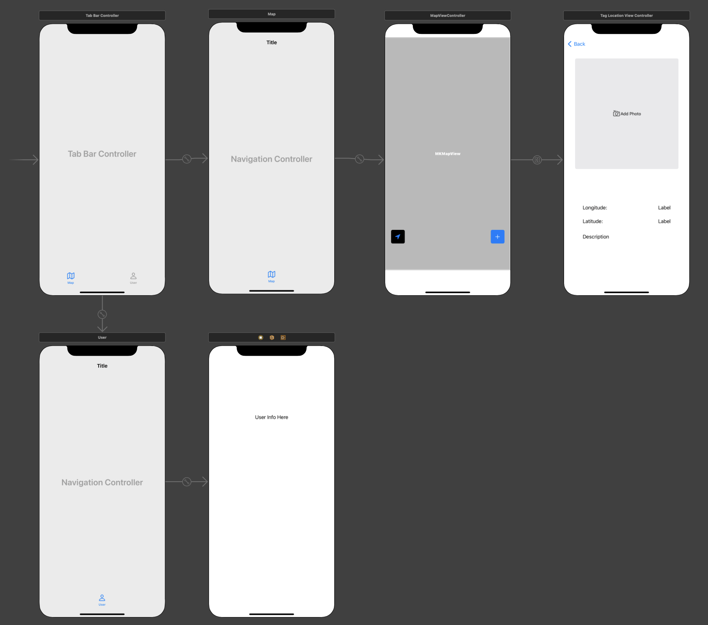

## Updates

Few more updates added...

1. Outline functionality for:

   - CLLocation Manager & related delegates
     - Mostly complete, major functionality included
   - Camera usability, storing current photo
   - Paths to photos, storage URL, etc
   - userPost Object and related methods
   - userPost structs and definitions
   - Firebase cocoa pod integration
     - Added, no analytics included for now. May integrate later

2. Build out the User Interface
   - Add Apple Mapkit
     - Added to unique view controller with tab
     - Needs constraints on the view/tab
     - Added in get user location button
       - Function to zoom on user added
   - Add tableBar with tableView, MapView, userProfile buttons
     - In progress, two tab bars included
     - May not do the tableView for initial release
   - Add getUserLocation button
     - Tag location view added with basic information
       - Longitude
       - Latitude
       - Description
       - Button for Image Picker
   - Add addPost button

## Updates to Views



## Testing Zoom on User and Navigation to Tag Location



### Zooming on user

To zoom in on the user, we first define a region with `struct MKCoordinateRegion` with initializer:

```
init(center: CLLocationCoordinate2D, latitudinalMeters: CLLocationDistance, longitudinalMeters: CLLocationDistance)
```

The CLLLocationCoordinate2D can be pulled from the mapview to point at user position.

Wrap this into a function and add an IBAction from the Arrow button so that it implies "zoom to user location", similar to how Google maps does it.

```Swift
@IBAction func getUserLocation {
  //create a region to zoom on
  let region = MKCoordinateRegion {
    center: mapView.userLocation.coordinate, //grab user coordinate
    latitudinalMeters: 1000,                 //lat span
    longitudinalMeters: 1000)                //long span
  }

  //Change to the region provided within this method
  mapView.setRegion(
    //adjust the region with proper aspect ratios and centerpoint
    mapView.regionThatFits(region),
    animated: true
    )
}

```
