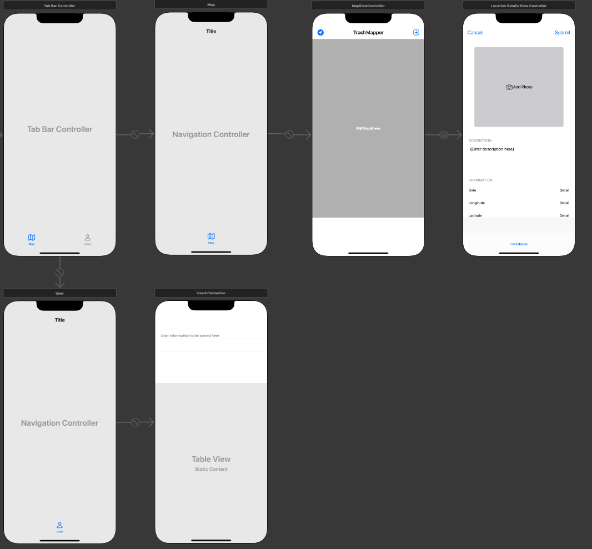

## Updates

Whew, what a day it has been! I spent a solid 5-6 hours reviewing the outline of this application. Flow, navigation, controller setup, all went through some more thought and comparison of projects online.

Let's go ahead and dive into some of the changes.

Also to note - I'm currently working from the develop branch of this project. I plan to create separate branches for camera functionality, firebase, and others moving forward.

Location of code is here - [TrashMapper/tree/develop](https://github.com/jcase34/TrashMapper-iOS-Project/tree/develop)

---

### UIViewControllers to Static UITableViewControllers

Up first in the change list was the LocationDetailViewController. Initially this was a normal UIViewController. I had planned to add a button for the image capture, some labels, and a description field to capture text from the user.

After doing some hunting online though I found that incorporating a UITableViewController would be easier to manage in terms of the visual view and information capture.



The user profile has still yet to be filled out, so only a placeholder for now.

---

### Load and Zoom to user

One feature I wanted to replicate was the initial zoom to user location as seen on Google Maps.

The logic behind this still needs to be cleaned up. Right now I'm using a timer, but really I should be checking for when we are no longer searching for a location.

```Swift
override func viewDidLoad() {
   super.viewDidLoad()

   // Do any additional setup after loading the view.
   print("At mapviewcontroller")
   timer = Timer.scheduledTimer(timeInterval: 2, target: self, selector: #selector(zoomUserLocation), userInfo: nil, repeats: false)

   //pull data from firebase
   //load as pins on map
   //fetched posts should omit userID for privacy


}

override func viewWillAppear(_ animated: Bool) {
   super.viewWillAppear(animated)
   getLocation()
}
```

I'm leaving it as is for now because the simulator has some oddities when first establishing location.



---

### Add Location and New TableViewController for Tagging Location

This is the final major edit to the project so far. I swapped the UIViewController out for a UITableViewController and assigned the table to static instead of dynamic.

There is a way to keep the dynamic property set on the tablView, but do to the amount of time I struggled with this and functionality I need, static will do OK.

I use the same "Add Photo" but this time in a tableViewCell, attaching constraints to the edges of the cell size. I also take advantage of the data labels assigned within the cells and use those to populate a dummy location of interest.



To populate the table view, I use a prepare segue that contains the location coordinates and pass those off to the LocationDetailViewController. The date parameter is created when called, and the description is just replaced with a dummy string.

```Swift
  //mapviewcontroller
  // MARK: - Navigation
    override func prepare(for segue: UIStoryboardSegue, sender: Any?) {
        print("prepping for segue, identifier = \(String(describing: segue.identifier))")
        if segue.identifier == "AddLocation" {
            let destinationVC = segue.destination as! LocationDetailsViewController
            destinationVC.coordinate = location!.coordinate
      }
    }


  //LocationDetailViewController
  override func viewDidLoad() {
  super.viewDidLoad()
  // Do any additional setup after loading the view.


  descriptionTextView.text = "hello world"
  latitudeLabel.text = String(format: "%.8f", coordinate.latitude)
  longitudeLabel.text = String(format: "%.8f", coordinate.longitude)
  dateLabel.text = format(date: Date())

  }
```

### Simulator


